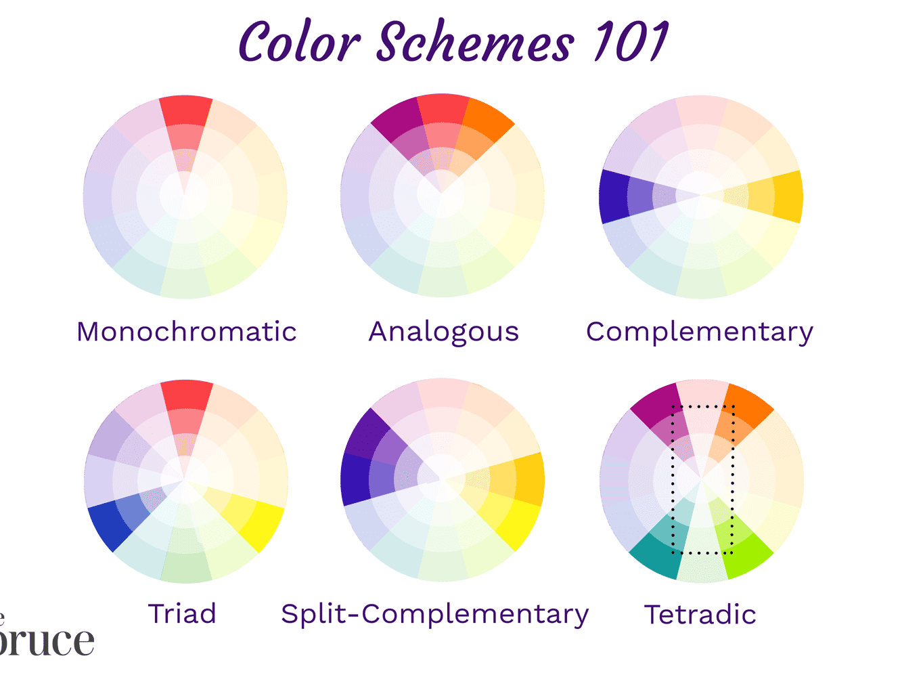
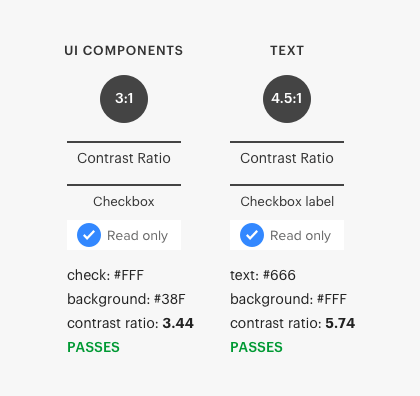
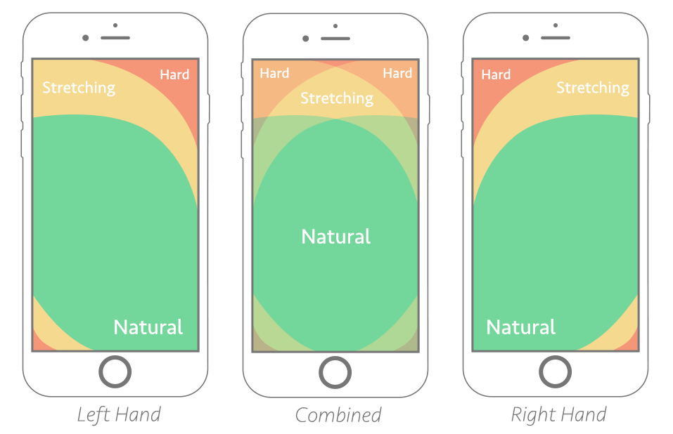

# **FIGMA COURSE**

1. **Getting Started** : Sketching, Inspiration, User Flows, Sitemaps.
2. **Explore and Iterate** : Wireframes, Prototyping, Getting Feedback.
3. **Visual Design** : Accessibility, Imagery + Iconography, Color, Grids, Typography, Forms + UI Elements.
4. **Design Exploration** : Design Patterns, Micro-interactions, Motion, Applying Visual Design, Mobile Design.

## **LOGO MAKER**

1. Fiverr Logo Maker
2. Hatchful Logo Maker
3. Namecheap's Free Logo Maker

## **Goodui.org**

1. Improve Your UI with Winning & Losing A/B Tests.

# **FIGMA**

1.  **What are User Flows??**

    ```
    Go to welcome screen ===> Use Social Login === Get instant access to product!
    ```

    NOTE: Figma creates a flow starting point when you add first connection between two frames,
    There are a few other ways to add a flow starting point to your prototype:
    With the starting frame selected, click in the Flow starting point section of the right sidebar.
    Right-click on the frame, then click Add starting point.

# **SITEMAP**

    NOTE: A sitemap is a file where you provide information about the pages, videos and other files on your site, and the relationships between them.

# **WIREFRAME**

    NOTE: A wireframe is a two-dimensional illustration of a page's interface that specifically focuses on space allocation and
    priorization of content, functionalities available, and intended behaviors.

# **PROTOTYPING**

    NOTE: Allow you to create intereactive flows that explore how a user may interact with your designs.
    Prototypes are a fantastic way to : Preview **interactions** and user flows.

# **TYPOGRAPHY**

    SERIF : The little curls at the end of the letter forms are called serifs.

    NOTE: A typefaces is the design of lettering that can include variations size, weight, slope, width, and so on.

    What are the 5 types of typefaces? : There are five basic classifications of typefaces: serif, sans serif, monospaced, and
    display.

    TYPEFACES : Old Style , Transitional, Modern, Slab.

    1. Sans Serif :

    1.1  Grotesque (Source Sans Pro)
    1.2  Neo-Grotesque (Helveltica)
    1.3  Humanist (Gills Sans)
    1.4  Geometric (Futura)

    2. Display
    3. Mono


# **COLOR SCHEMES**

**Monochromatic**

This colors will share the tense hues and tones of one primary color.
In theory, it's the simplest of all color schemes.
NOTE: And these are mostly used in minimal designs because one hue generally results in a less distracting layout.

**Analogous**

This is based off of three colors located next to each other on the color wheel.

**Complimentary**

A complementary color scheme is composed by using two colors opposite each other on the color wheel.

**Split Complimentary**

A split complementary scheme involves the use of three colors. Start with one color, find its complement and then
use the two colors on either side of it. For Example, the complement of blue-green is red-orange and the split complement of blue-green would be red and orange.

**Triadic**

A triadic color scheme, a unique variant of the split complementary color scheme, with an equal distance between
all colors.

All three colors are distributed evenly around the color wheel, causing there to be no clear superiority of one color.



# **ACCESSUBILITY**

**Color contrast**

This will help those with visual impairments to see and to discern information on the

recommended contrast is three to one for large text and four point five to one for small text.



**Tools**:

Color Safe : colorsafe.co
Control Contrast Analyzer : Google Chrome Extension

# **DESIGN EXPLORATION APPLICATION DESIGN AND DESIGN SYSTEMS**

Material:

1. https://ui-patterns.com/patterns/rule-builder
2. https://developer.apple.com/design/human-interface-guidelines/
3. https://developer.android.com/design
4. https://atomicdesign.bradfrost.com/chapter-2/
5. https://www.interaction-design.org/literature/topics/visual-design
6. https://www.nngroup.com/articles/principles-visual-design/
7. https://uxdesign.cc/the-ultimate-guide-to-proper-use-of-animation-in-ux-10bd98614fa9
8. https://medium.com/ux-in-motion/creating-usability-with-motion-the-ux-in-motion-manifesto-a87a4584ddc
9. https://blog.prototypr.io/the-importance-of-motion-for-ux-design-7710edcdae3a
10. https://www.wyzowl.com/how-to-use-microinteractions/
11. https://www.toptal.com/designers/product-design/microinteractions-better-ux

# **DESIGN PATTERNS**

Design patterns are the recurring solutions that solve common design problems. These are standard reference points
for a designer.

**Categories of Design Patterns**

1. Data Input
2. Content Structuring
3. Navigation
4. Incentivisation
5. Hierarchy
6. Social Media

# **MOBILE DESIGN BEST PRACTICES**

**Best Practices**

1. Autocomplete (dinamically)
2. Good and understandable layout
3. A few animations (state Transition)
4. Consistency (colors, patterns, layout and flow).
5. Predictable ==> Use Universal Icons.
6. The illusion of a fast product.
7. Welcome page (engaging).
8. login and logout with a logo engaging
9. design for fingers.



# **MOTION AND MICROINTERACTIONS**

1. They can create seamless experiences.
2. They help prevent errors :
